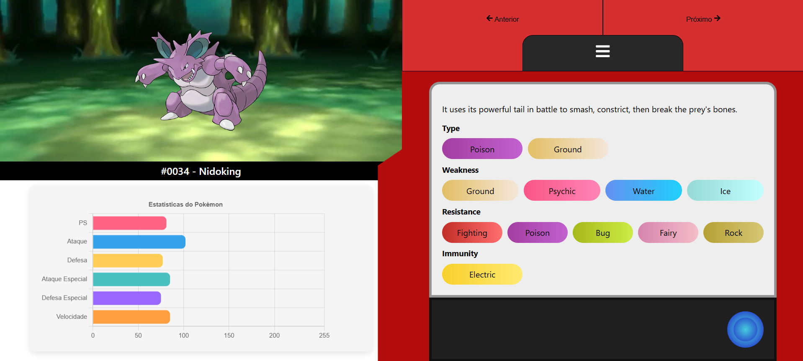

# Pokédex React

O projeto da [Pokedex React](https://imoutofbounds.github.io/pokedex-react/) usa a PokéApi para criar uma interface que mostra as estatisticas de cada um dos monstrinhos.


Projeto finalizado


## Rodar localmente

Após clonar o projeto, abra o terminal na pasta raíz e digite

```bash
npm i
```

Após todos os node_modules serem baixados, digite

```bash
npm start
```

## Como alterar o projeto

- O projeto está dividido em componentes, que podem ser encontrados dentro de src/components
- O aplicativo é montado no arquivo App.js, localizado dentro de src
- A estilizalção dos componentes é feita por meio do uso da biblioteca Styled-components, para a criação de arquivos de estilização, é necessário adicionar as devidas referencias da biblioteca em um arquivo .js, como no exemplo abaixo:

```js
// import da biblioteca
import styled from "styled-components";

export const Container = styled.div`
  // regras de css
  ...
`;

export const StyledBtn = styled.button`
  // regras de css
  ...
`;
```

Então, no componente em questão "precisa ser um arquivo .jsx" referenciar da seguinte forma

```jsx
import { Container, StyledBtn } from './style';

function ComponenteExemplo({ onPrev, onNext }) {
  return (
    <Container>
      <StyledBtn />
    </Container>
  );
}

export default ComponenteExemplo;

```

- Na main "App.js" os componentes são chamados da seguinte forma:

```js

import ComponenteExemplo from './components/componenteExemplo/ComponenteExemplo';


function App() {
  return (
    
    <>
        <ComponenteExemplo />
    </>
  );
}

export default App;

```